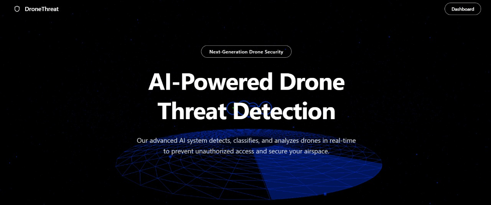
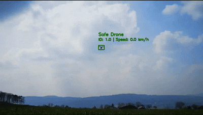
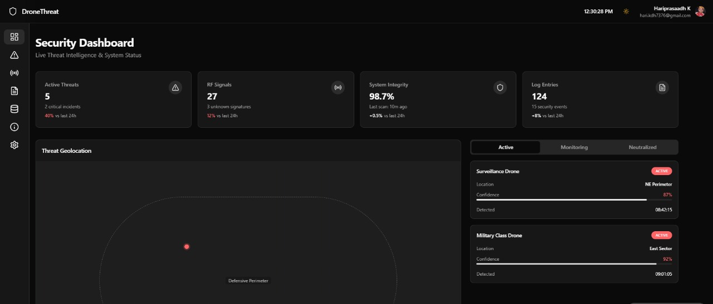

# 🛡️ Drone Threat Detection & Classification

## 🚀 Overview

The AI Drone Threat Classifier is a real-time drone detection, tracking, and classification system designed for enhanced security and surveillance. It leverages advanced AI techniques to predict drone trajectories and classify threats based on multiple parameters. The system integrates RF frequency sensing for classification, ESP32 for detecting nearby WiFi connections and their status, and blockchain technology for securely storing data on malicious drones, including their speed, coordinates, and trajectory. The solution also features real-time map integration, allowing precise geolocation of drones on an interactive map.

## 🎯 Features

### 🔍 Real-Time Drone Detection & Tracking
- Detects drones in real-time and tracks their movement.
- Predicts drone trajectory for **better situational awareness**.

### 🎛️ Threat Classification
- **RF frequency sensing** to classify drones based on signals.
- Categorizes drones as **benign or malicious** based on flight behavior.

### 🔗 Blockchain Security
- Stores **malicious drone data** securely using **blockchain**.
- Logs **speed, coordinates, and threat level** in a tamper-proof ledger.

### 🗺️ Live Map Integration
- Displays drone locations in **real-time** using **GPS coordinates**.
- Visualizes drone movement directly on **interactive maps**.

### 📡 ESP32-Based WiFi Sensing
- Uses **ESP32** to detect nearby WiFi connections.
- Measures **signal strength, range, and connection status** to assess threats.

### 🛰️ 3D Drone Trajectory Visualization with Three.js
- Uses **Three.js** to render real-time **3D drone flight paths**.
- Interactive 3D environment to **visualize drone motion and behavior**.
- Allows **zoom, pan, and rotate** for better situational understanding.

## 🖼️ Screenshots

### 🎯 Real-Time Drone Tracking

### 🔗 Analysis

## 🏗️ Tech Stack

| Component           | Technology Used  |
|---------------------|----------------|
| **Computer Vision** | Object detection & tracking |
| **RF Sensing**      | Frequency analysis for classification |
| **Blockchain**      | Secure logging of malicious drones |
| **Mapping**        | Live GPS tracking & visualization |
| **Embedded Systems** | ESP32 for WiFi sensing |
| **3D Visualization** | Three.js for real-time 3D drone trajectory |

## 💡 Use Cases & Applications  

- 🏛️ **Government & Military**: Detect and intercept unauthorized drones in **restricted airspace** near government buildings, defense sites, and borders.  
- 🏭 **Industrial Security**: Protect **power plants, oil refineries, and critical infrastructure** from aerial surveillance and drone-based attacks.  
- 🏟️ **Public Event Safety**: Prevent unauthorized drones from **disrupting large gatherings** like concerts, sports events, and political rallies.  
- 🚔 **Law Enforcement**: Monitor, track, and **neutralize rogue drones** used for illegal surveillance, smuggling, or terrorist activities.  
- 🛬 **Airport & Airspace Security**: Detect and prevent drones from entering **no-fly zones** near **airports** to **avoid collisions with aircraft**.  
- 🏢 **Corporate Espionage Protection**: Secure corporate campuses from unauthorized drones attempting to **steal confidential information**.  
- 🌲 **Wildlife Conservation & Anti-Poaching**: Detect and track **illegal drones used for poaching or harming protected wildlife** in forests and national parks.  
- 🚢 **Maritime Security**: Identify and classify drones monitoring **naval vessels, ports, or offshore drilling rigs** for espionage or piracy.  
